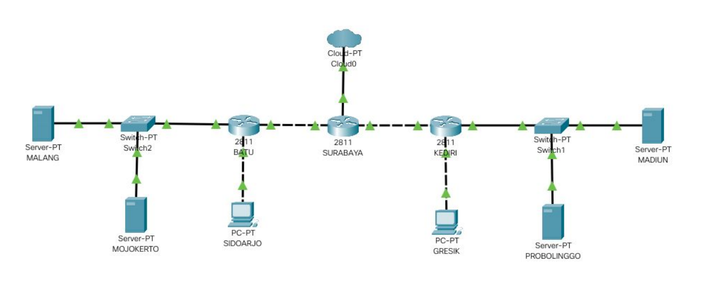
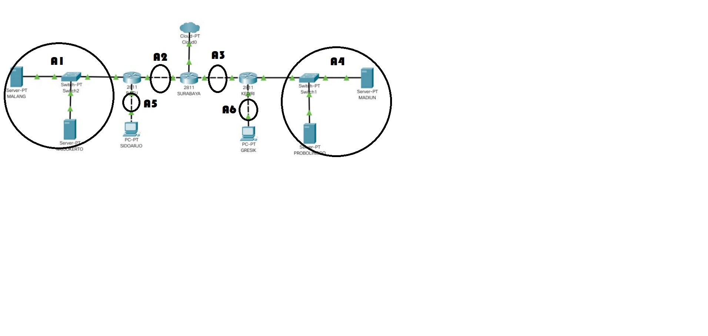
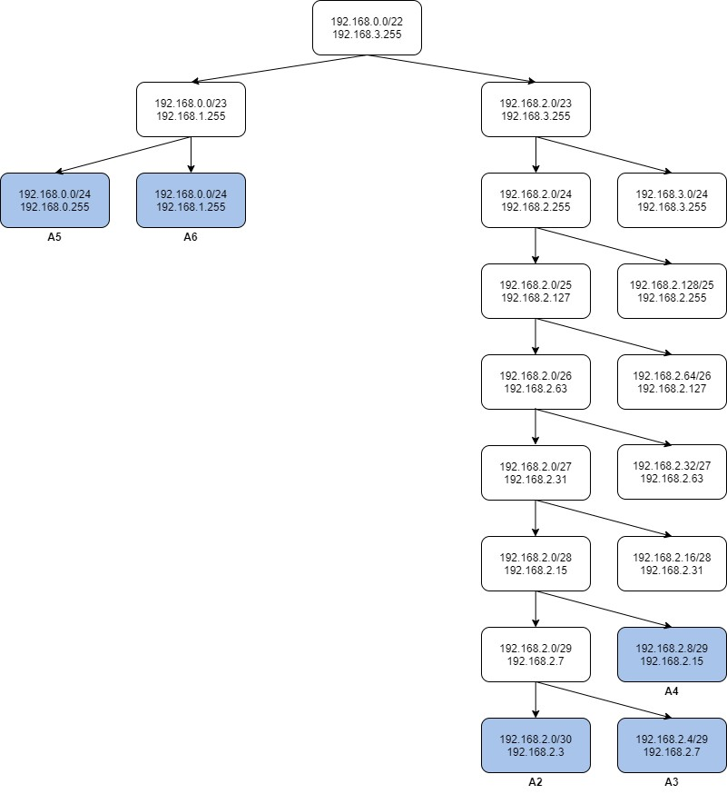

# Jarkom_Modul5_Lapres_C14
## Kelompok C14
* M Ridho Daffa Ardista 05111840000065
* Rifki Aulia Irawan 05111840000142
### A. Topologi jaringan sesuai dengan rancangan yang diberikan Bibah

**topologi.sh**
```
# Switch
uml_switch -unix switch1 > /dev/null < /dev/null &
uml_switch -unix switch2 > /dev/null < /dev/null &
uml_switch -unix switch3 > /dev/null < /dev/null &
uml_switch -unix switch4 > /dev/null < /dev/null &
uml_switch -unix switch5 > /dev/null < /dev/null &
uml_switch -unix switch6 > /dev/null < /dev/null &

# Router
xterm -T SURABAYA -e linux ubd0=SURABAYA,jarkom umid=SURABAYA eth0=tuntap,,,10.151.76.61 eth1=daemon,,,switch3 eth2=daemon,,,switch2 mem=96M &
xterm -T BATU -e linux ubd0=BATU,jarkom umid=BATU eth0=daemon,,,switch2 eth1=daemon,,,switch5 eth2=daemon,,,switch1 mem=96M &
xterm -T KEDIRI -e linux ubd0=KEDIRI,jarkom umid=KEDIRI eth0=daemon,,,switch4 eth1=daemon,,,switch6 eth2=daemon,,,switch3 mem=96M &

# Server
xterm -T MALANG -e linux ubd0=MALANG,jarkom umid=MALANG eth0=daemon,,,switch1 mem=128M &
xterm -T MOJOKERTO -e linux ubd0=MOJOKERTO,jarkom umid=MOJOKERTO eth0=daemon,,,switch1 mem=128M &
xterm -T MADIUN -e linux ubd0=MADIUN,jarkom umid=MADIUN eth0=daemon,,,switch4 mem=128M &
xterm -T PROBOLINGGO -e linux ubd0=PROBOLINGGO,jarkom umid=PROBOLINGGO eth0=daemon,,,switch4 mem=128M &

# Klien
xterm -T SIDOARJO -e linux ubd0=SIDOARJO,jarkom umid=SIDOARJO eth0=daemon,,,switch5 mem=96M &
xterm -T GRESIK -e linux ubd0=GRESIK,jarkom umid=GRESIK eth0=daemon,,,switch6 mem=96M &
```
### B. VLSM
* Pembagian Subnet

* Pohon IP

* Interfaces  
SURABAYA (Router)
```
auto lo
iface lo inet loopback

auto eth0
iface eth0 inet static
address 10.151.76.62
netmask 255.255.255.252
gateway 10.151.76.61

auto eth1
iface eth1 inet static
address 192.168.2.5
netmask 255.255.255.252

auto eth2
iface eth2 inet static
address 192.168.2.1
netmask 255.255.255.252
```
BATU (Router)
```
auto lo
iface lo inet loopback

auto eth0
iface eth0 inet static
address 192.168.2.2
netmask 255.255.255.252

auto eth1
iface eth1 inet static
address 192.168.0.1
netmask 255.255.255.0

auto eth2
iface eth2 inet static
address 10.151.77.121
netmask 255.255.255.24
```
KEDIRI (Router)
```
auto lo
iface lo inet loopback

auto eth0
iface eth0 inet static
address 192.168.2.9
netmask 255.255.255.248

auto eth1
iface eth1 inet static
address 192.168.1.1
netmask 255.255.255.0

auto eth2
iface eth2 inet static
address 192.168.2.6
netmask 255.255.255.252
```
MALANG (DNS Server)
```
auto lo
iface lo inet loopback

auto eth0
iface eth0 inet static
address 10.151.77.122
netmask 255.255.255.248
gateway 10.151.77.121
```
MOJOKERTO (DHCP Server)
```
auto lo
iface lo inet loopback

auto eth0
iface eth0 inet static
address 10.151.77.123
netmask 255.255.255.248
gateway 10.151.77.121
```
MADIUN (Web Server)
```
auto lo
iface lo inet loopback

auto eth0
iface eth0 inet static
address 192.168.2.10
netmask 255.255.255.248
gateway 192.168.2.9

```
PROBOLINGGO (Web Server)
```
auto lo
iface lo inet loopback

auto eth0
iface eth0 inet static
address 10.151.77.123
netmask 255.255.255.248
gateway 10.151.77.121
```
Untuk UML GRESIK dan SIDOARJO (DHCP Relay) akan dibahas pada soal D
### C. Routing
Surabaya (***route.sh***)
```
route add -net 0.0.0.0 netmask 0.0.0.0 gw 10.151.76.62 #internet
route add -net 10.151.77.120 netmask 255.255.255.248 gw 192.168.2.2 #Server malang dan mojo
route add -net 192.168.2.8 netmask 255.255.255.248 gw 192.168.2.6 #Server madiun probo
route add -net 192.168.0.0 netmask 255.255.255.0 gw 192.168.2.2 #Batu
route add -net 192.168.1.0 netmask 255.255.255.0 gw 192.168.2.6 #Kediri
```
### D. DHCP
Install DHCP server pada MOJOKERTO (DHCP server) ```apt-get install isc-dhcp-server```, Install DHCP Relay pada GRESIK dan SIDOARJO (DHCP Relay) ```apt-get install isc-dhcp-relay```.  
Tambahkan juga pada interface GRESIK dan SIDOARJO  
```
auto lo
iface lo inet loopback

auto eth0
iface eth0 inet dhcp
```
Pada MOJOKERTO ```nano /etc/default/isc-dhcp-server```, Tambahkan interface ```eth0``` pada INTERFACESv4 ```INTERFACESv4="eth0"```.  
Setelah itu edit ```nano /etc/dhcp/dhcpd.conf``` Tambahkan
```
subnet 192.168.0.0 netmask 255.255.255.0 {
    range 192.168.0.2 192.168.0.254;
    option routers 192.168.0.1;
    option broadcast-address 192.168.0.255;
    option domain-name-servers 10.151.77.122;
    default-lease-time 600;
    max-lease-time 7200;
}

subnet 192.168.1.0 netmask 255.255.255.0 {
    range 192.168.1.2 192.168.1.254;
    option routers 192.168.1.1;
    option broadcast-address 192.168.1.255;
    option domain-name-servers 10.151.77.122, 202.46.129.2;
    default-lease-time 600;
    max-lease-time 7200;
}

subnet 10.151.77.120 netmask 255.255.255.248 {

}
```
Restart ```service isc-dhcp-server restart```
### 1. Bisa akses keluar tanpa MASQUERADE
Pada SURABAYA tambahkan perintah iptables sebagai berikut:  
```
iptables -t nat -A POSTROUTING -o eth0 -j SNAT --to 10.151.76.62
```  
Dengan perintah diatas setiap paket yang menuju keluar akan dirubah sourcenya menjadi 10.151.76.62. Bisa di test dengan melakukan ping web dengan semua uml
### 2. Akses SSH di luar topologi akan di-DROP ketika mengakses server yang memiliki IP DMZ
Pada SURABAYA tambahkan perintah iptables sebagai berikut:  
```
iptables -A FORWARD -p tcp -s 10.151.0.0/16 --dport 22 -d 10.151.77.121/29 -j DROP
```  
***Test***  
Install netcat pada seluruh UML dengan perintah ```apt-get install netcat```.  
Jalan kan perintah ```nc 10.151.77.122 22``` pada putty atau SURABAYA.  
Jika kosong maka sudah sesuai.
### 3. DHCP Server dan DNS Server maksimal menerima 3 koneksi ICMP secara bersamaan, selebihnya di-DROP
Pada UML MALANG dan MOJOKERTO tambahkan perintah iptables sebagai berikut:   
```iptables -A INPUT -p icmp -m connlimit --connlimit-above 3 --connlimit-mask 0 -j DROP```  
***Test***  
Bisa di test dengan melakukan ping ke UML MALANG atau MOJOKERTO
### 4&5. SIDOARJO dan GRESIK diberikan waktu akses untuk mengakses server MALANG
Pada MALANG tambahkan perintah iptables sebagai berikut:  
```
iptables -A INPUT -s 192.168.0.0/24 -m time --timestart 07:00 --timestop 17:00 --weekdays Mon,Tue,Wed,Thu,Fri -j ACCEPT
iptables -A INPUT -s 192.168.0.0/24 -m time --timestart 17:01 --timestop 06:59 -j REJECT
iptables -A INPUT -s 192.168.0.0/24 -m time --timestart 07:00 --timestop 17:00 --weekdays Sat,Sun -j REJECT
```
***Test***  
Bisa di test dengan melakukan ping ke Sesuai waktu
### 6. Setiap request dari client yang mengakses mengakses DNS Server akan secara bergantian didistribusikan ke PROBOLINGGO dan MADIUN pada port 80
Pada SURABAYA tambahkan perintah iptables sebagai berikut:  
```
iptables -A PREROUTING -t nat -d 10.151.77.122 -p tcp --dport 80 -m statistic --mode nth --every 2 --packet 0 -j DNAT --to-destination 192.168.2.10:80
iptables -A PREROUTING -t nat -d 10.151.77.122 -p tcp --dport 80 -j DNAT --to-destination 192.168.2.11:80
```
***Test***  
Install netcat pada seluruh UML dengan perintah ```apt-get install netcat```.  
Jalan kan perintah ```nc 10.151.77.122 22``` pada putty atau SURABAYA.  
Jika kosong maka sudah sesuai.
### 7. Logging semua paket yang di-DROP
Pada SURABAYA tambahkan perintah iptables sebagai berikut:  
```
iptables -N LOGGING
iptables -A FORWARD -j LOGGING
iptables -A LOGGING -m limit --limit 2/min -j LOG --log-prefix "IP Tables Packet Dropped: " --log-level 4 
iptables -A LOGGING -j DROP
```
Pada MALANG dan MOJOKERTO tambahkan perintah iptables sebagai berikut:  
```
iptables -N LOGGING
iptables -A INPUT -j LOGGING
iptables -A OUTPUT -j LOGGING
iptables -A LOGGING -j LOG --log-prefix "IP Tables Packet Dropped: " --log-level 4
iptables -A LOGGING -j DROP
```
